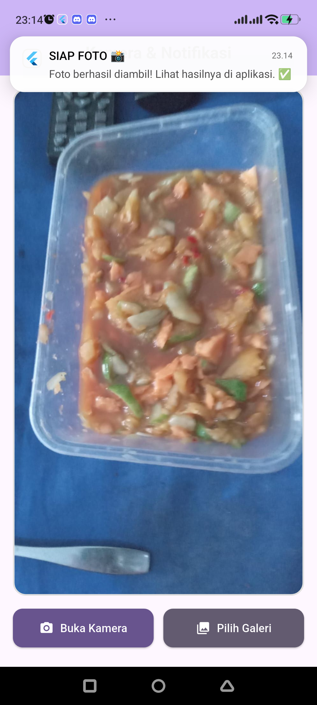

# 🔍 Camera Notification Application

A Flutter app that captures or selects a photo, previews it on screen, and triggers a local notification after the image is loaded.


## 📌 Overview

Camera Notification Application is a Flutter mobile app for practicing device camera, gallery access, runtime permissions, image preview, and local notification workflows. The app gives users two clear actions: open the camera or choose an image from the gallery.

The system is structured around a main page and two services: `CameraService` for image picking and `NotificationService` for local notification setup and delivery. After a successful camera capture or gallery selection, the selected image is shown in the main preview area and a notification is displayed.

The target use case is a practical Flutter learning project for mobile permission handling, media access, and notification integration.

## 🧠 Model & Methodology

This project does not use a machine learning model. Its methodology is a **service-based Flutter mobile workflow**:

| Component | Purpose | Notes |
|---|---|---|
| `image_picker` | Camera/gallery image selection | Used by `CameraService`. |
| `permission_handler` | Runtime permission requests | Handles camera and media/storage permission checks. |
| `flutter_local_notifications` | Local notification display | Initialized before `runApp`. |
| `StatefulWidget` | Image preview state | Stores the selected image as a `File`. |

## ✨ Features

- ✅ Capture photos directly from the device camera.
- 🖼️ Select photos from the gallery.
- 🔔 Show local notification after a photo is selected or captured.
- 🔐 Request camera and storage/media permissions at runtime.
- 👁️ Display selected image preview on the home screen.
- ⚠️ Show SnackBar feedback when permissions or image actions fail.

## 🛠️ Tech Stack

**Core:** Dart, Flutter  
**Mobile:** image_picker, permission_handler, flutter_local_notifications  
**Frontend:** Material 3 widgets  
**Tools:** Flutter SDK, flutter_lints


## ⚡ Strengths & Limitations

**Strengths:**

- Separates camera and notification logic into dedicated service classes.
- Handles runtime permission requests before accessing camera or gallery.
- Provides direct visual feedback through image preview and SnackBar messages.
- Includes output screenshots in the `Output/` folder.

**Limitations:**

- The app does not persist selected images after restart.
- Notification content is local and static.
- No automated tests for permission and notification flows are included.

Future improvements may include saving image history and adding configurable notification messages.

## 📁 Project Structure

```text
Camera_Notification_Application/
├── lib/
│   ├── main.dart                         # App entry point and notification initialization
│   ├── home_page.dart                    # Main UI, permissions, preview, and actions
│   └── services/
│       ├── camera_service.dart           # Camera and gallery image picker logic
│       └── notification_service.dart     # Local notification setup and display
├── Output/                               # Demo screenshots and widget explanation
├── test/widget_test.dart                 # Default widget test
├── pubspec.yaml                          # Flutter dependencies
└── README.md                             # Project documentation
```

## 🚀 Getting Started

### Prerequisites

- Flutter SDK
- Android device or emulator
- Camera/gallery permissions enabled on the target device

### Installation

```bash
git clone <repository-url>
cd Camera_Notification_Application
flutter pub get
```

### How to Run

```bash
flutter run
```

## 📊 Results & Performance

This project is a mobile feature demo. No model metrics are available.



## 👨‍💻 Author

**Axandio**  
LinkedIn: Not provided in project files  
GitHub: Not provided in project files

Open to collaborations and feedback — feel free to reach out!

---
> ⭐ If you find this project useful,
> please give it a star!

## 💡 Portfolio Suggestions

1. Add a short GIF showing camera/gallery selection and notification behavior.
2. Add Android permission setup notes from `AndroidManifest.xml`.
3. Add widget or integration tests for the happy path.
