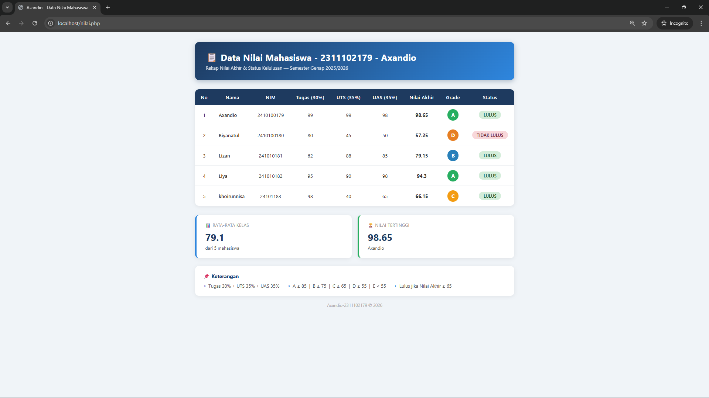

# 🔍 Website Scoring Student

A PHP-based student grade reporting page that calculates weighted final scores, letter grades, pass/fail status, and class statistics.


## 📌 Overview

Website Scoring Student is a simple PHP web page for displaying student grades in a structured report. It calculates each student's final score from assignment, midterm, and final exam components, then assigns a grade and pass/fail status.

The page also summarizes class-level performance by computing the class average and highest score. The interface uses HTML and embedded CSS to present a responsive table, grade badges, status labels, statistic cards, and grading rules.

The target use case is an academic scoring report or beginner PHP exercise that demonstrates arrays, functions, loops, conditional grading, and safe output with `htmlspecialchars`.

## 🧠 Model & Methodology

This project does not use a machine learning model. It uses a **weighted scoring formula**:

| Component | Weight |
|---|---:|
| Assignment / `nilai_tugas` | 30% |
| Midterm / `nilai_uts` | 35% |
| Final Exam / `nilai_uas` | 35% |

Grade rules:

| Final Score | Grade |
|---:|---|
| >= 85 | A |
| >= 75 | B |
| >= 65 | C |
| >= 55 | D |
| < 55 | E |

Students pass when the final score is at least **65**.

## ✨ Features

- ✅ Weighted final score calculation.
- 🎓 Letter grade assignment from A to E.
- 🟢 Pass/fail status labels.
- 📊 Class average calculation.
- 🏆 Highest score and student name summary.
- 🧾 Clean report table with styled grade badges.
- 🔐 HTML output escaping for student names and IDs.

## 🛠️ Tech Stack

**Core:** PHP  
**Frontend:** HTML, CSS  
**Data:** Hardcoded PHP array of student records  
**Tools:** PHP built-in server or local PHP runtime


## ⚡ Strengths & Limitations

**Strengths:**

- Clear separation of scoring logic into PHP functions.
- Includes class-level summary statistics beyond row-level scores.
- Uses simple, readable conditional logic for grades and pass/fail status.
- Includes a screenshot output in the project folder.

**Limitations:**

- Student data is hardcoded in the PHP file.
- No form input, database, authentication, or export feature.
- No automated tests are included.

Future improvements may include adding a form for dynamic student input and storing records in a database.

## 📁 Project Structure

```text
Website_Scoring_Student/
├── nilai.php        # Main PHP scoring page
├── output.png       # Screenshot of the rendered result
└── README.md        # Project documentation
```

## 🚀 Getting Started

### Prerequisites

- PHP installed locally

### Installation

```bash
git clone <repository-url>
cd Website_Scoring_Student
```

### How to Run

```bash
php -S localhost:8000
```

Open `http://localhost:8000/nilai.php`.

## 📊 Results & Performance

This project outputs calculated grades and summary statistics from the provided sample student data.



## 👨‍💻 Author

**Axandio**  
LinkedIn: Not provided in project files  
GitHub: Not provided in project files

Open to collaborations and feedback — feel free to reach out!

---
> ⭐ If you find this project useful,
> please give it a star!

## 💡 Portfolio Suggestions

1. Add a form to enter student scores dynamically.
2. Store student records in MySQL or SQLite.
3. Add CSV/PDF export for grade reports.
